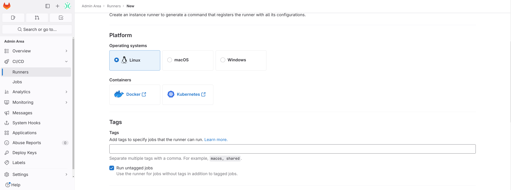

<div align="center">
    
    
    <h1 align="center"> Gitlab CE & Gitlab Runner in Docker </h1>
</div>

<!-- START doctoc generated TOC please keep comment here to allow auto update -->

<!-- DON'T EDIT THIS SECTION, INSTEAD RE-RUN doctoc TO UPDATE -->

 

## Table of Contents

- [Introduction](#introduction)
- [Prerequisites](#prerequisites)
- [Getting Started](#getting-started)
- [Containers Volumes](#containers-volumes)
- [Create Shared Runners](#create-shared-runners)


## Introduction

This repository contains a docker-compose.yml to run Gitlab Community Edition & Gitlab Runner in 2 docker containers in a virtual docker network.

##### **Note**:

This branch uses the following docker images:

- for gitlab CE server : **gitlab/gitlab-ce:16.6.0-ce.0**

- for gitlab runner : **gitlab/gitlab-runner:ubuntu**
  and this is current version of **ubuntu** for the **gitlab-runner** image
  


## Prerequisites

The following should be available in the host machine (computer, server, etc ...) in which you want to run Gitlab inside:

- git - to clone this repo
  
  - To check if installed in your terminal `git --version`

- docker
  
  - To check if installed in your terminal `docker --version`

- docker-compose
  
  - To check if installed in your terminal `docker-compose --version`


## Getting Started

1. First set your **initial root password** from the docker-compose.yml in the defined environment variable **GITLAB_ROOT_PASSWORD**:
   `GITLAB_ROOT_PASSWORD: <your_initial_root_password>`
   replace <your_initial_root_password> with your initial root password.

2. Run docker-composer:
   `docker-compose up -d`

3. The **Gitlab** server runs using port 80, so depending on your host machine you can either:
   
   1. access it locally (http://localhost) if you are running it locally
   
   2. or just access it using your domain name (http://<your-domain-name>)

4. Login with your initial root password with the username **root**
   
   
   this screenshot is taken from a gitlab instance running on a local machine
   
   you can later change your root password and delete the environment variable **GITLAB_ROOT_PASSWORD**.
   
   

## Containers Volumes

The conatiners shared volumes/storage are stored in a created folder in the same repo folder as seen in the docker-compose.yml file:

```yml
version: "3.7"
services:
  gitlab-server:
    image: "gitlab/gitlab-ce:16.6.0-ce.0"
    restart: always
    hostname: "localhost"
    container_name: gitlab-ce
    environment:
      GITLAB_OMNIBUS_CONFIG: |
        external_url 'http://localhost'
      GITLAB_ROOT_PASSWORD: <your_initial_root_password>
    ports:
      - "80:80"
      - "8443:443"
    volumes:
      - "$PWD/gitlab/config:/etc/gitlab"
      - "$PWD/gitlab/logs:/var/log/gitlab"
      - "$PWD/gitlab/data:/var/opt/gitlab"
    networks:
      - gitlab
  gitlab-runner:
    image: gitlab/gitlab-runner:ubuntu
    container_name: gitlab-runner
    restart: always
    depends_on:
      - gitlab-server
    volumes:
      - /var/run/docker.sock:/var/run/docker.sock
      - "$PWD/gitlab/gitlab-runner:/etc/gitlab-runner"
    networks:
      - gitlab

networks:
  gitlab:
    name: gitlab-network
```

**Notes**:

- This is running on Linux Mint, so if necessary you can replace the **$PWD** (print working directory) with the corresponding command on **macOS** or **Windows**


- For the volumes in **gitlab-runner** you should make sure to correctly map `/var/run/docker.sock` for **Windows** or **macOS**
  
  - Check for **Windows** maybe this link is helpful [Bind to docker socket on Windows - Stack Overflow](https://stackoverflow.com/questions/36765138/bind-to-docker-socket-on-windows)
  
  - Check for **macOs** maybe this link is helpful [Docker socket is not found while using Intellij IDEA and Docker desktop on MacOS - Stack Overflow](https://stackoverflow.com/questions/74173489/docker-socket-is-not-found-while-using-intellij-idea-and-docker-desktop-on-macos)


## Create Shared Runners

To create shared runners:

1. Open http://<your_host_address>/admin/runners
   

2. Click **New instance runner**

3. Select the OS, remember to tick on **Run untagged jobs** otherwise no job will run without a tag defined in **.gitlab-ci.yml**
   

4. You should see the token for the created runner
   

5. Copy the token and open your terminal and write this command
   `docker exec -it gitlab-runner gitlab-runner register  --url http://gitlab-server  --token glrt-b1fmQbz1wd2t_ep2eyY_ --docker-network-mode "host"`

6. Enter the **Gitlab instance url** and note that it should be the alias **http://gitlab-server** for **gitlab** inside docker virtual network
    

7. Test your shared runner in a repo by running a pipeline (make sure shared runners are enabled for this repo), see [CI/CD pipelines | GitLab](https://docs.gitlab.com/ee/ci/pipelines/)
   

8. You can copy this repo [simple-ci · GitLab](https://gitlab.com/atarekmokhtar90/simple-ci) into your own **Gitlab server** and it should succeed
   
   
